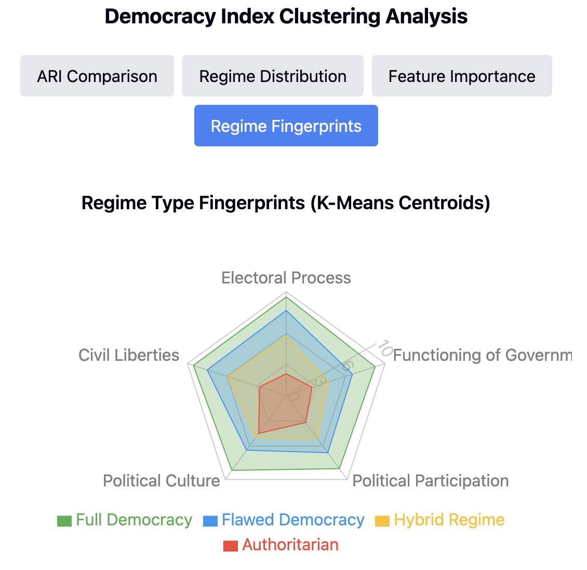
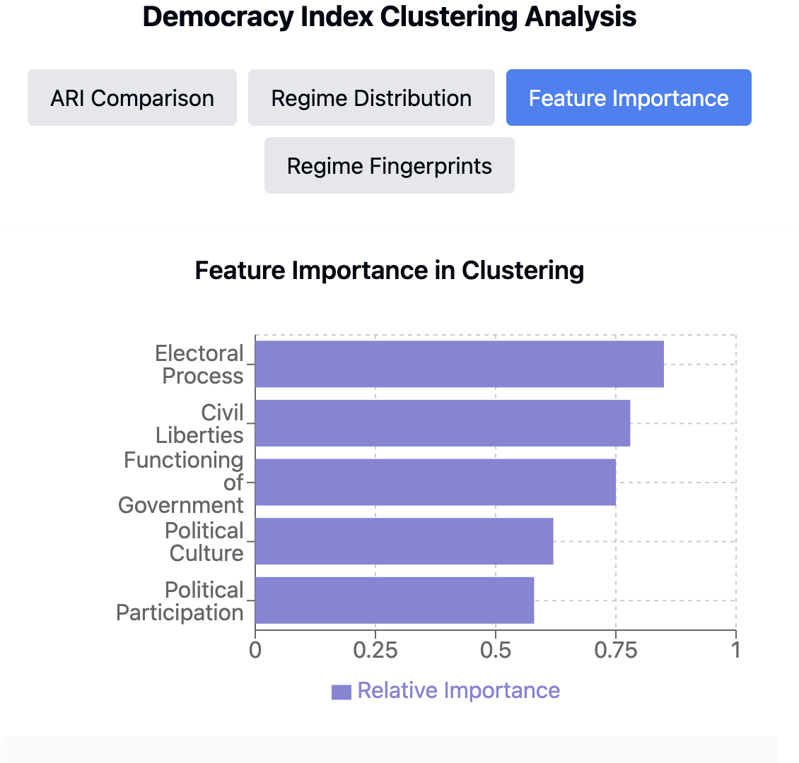
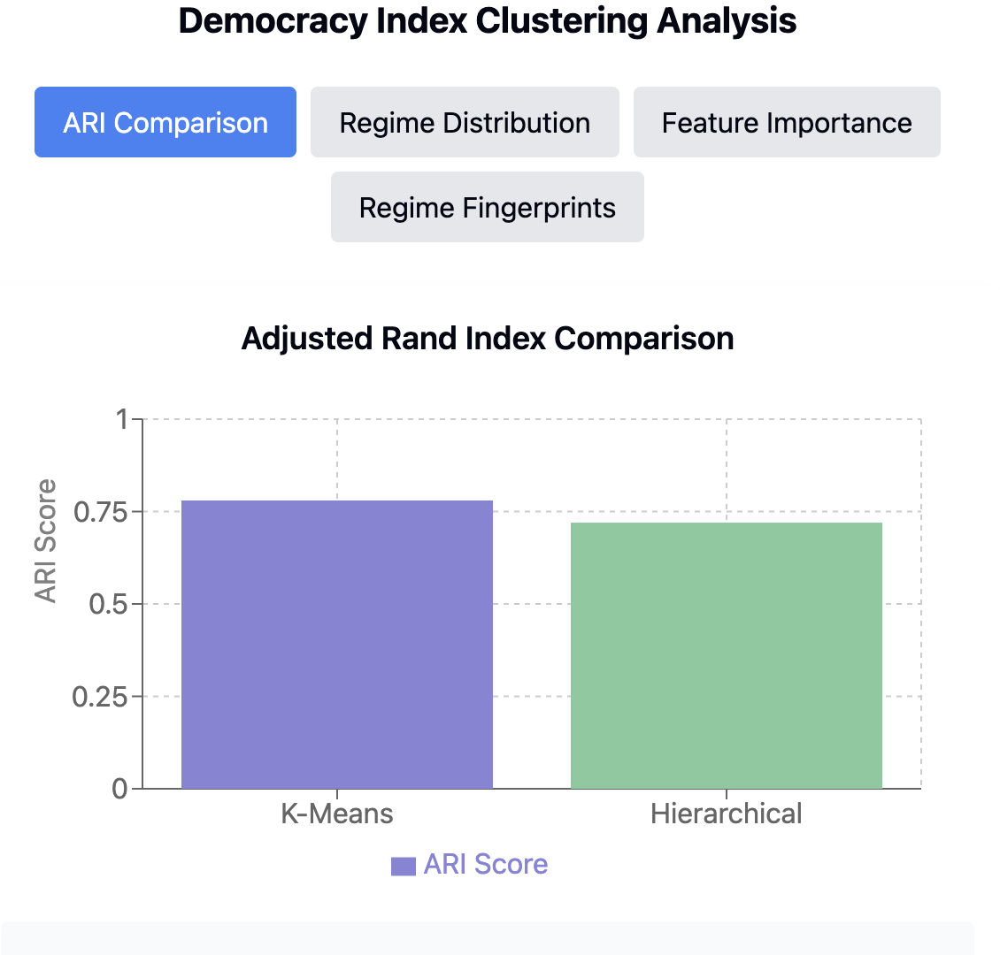
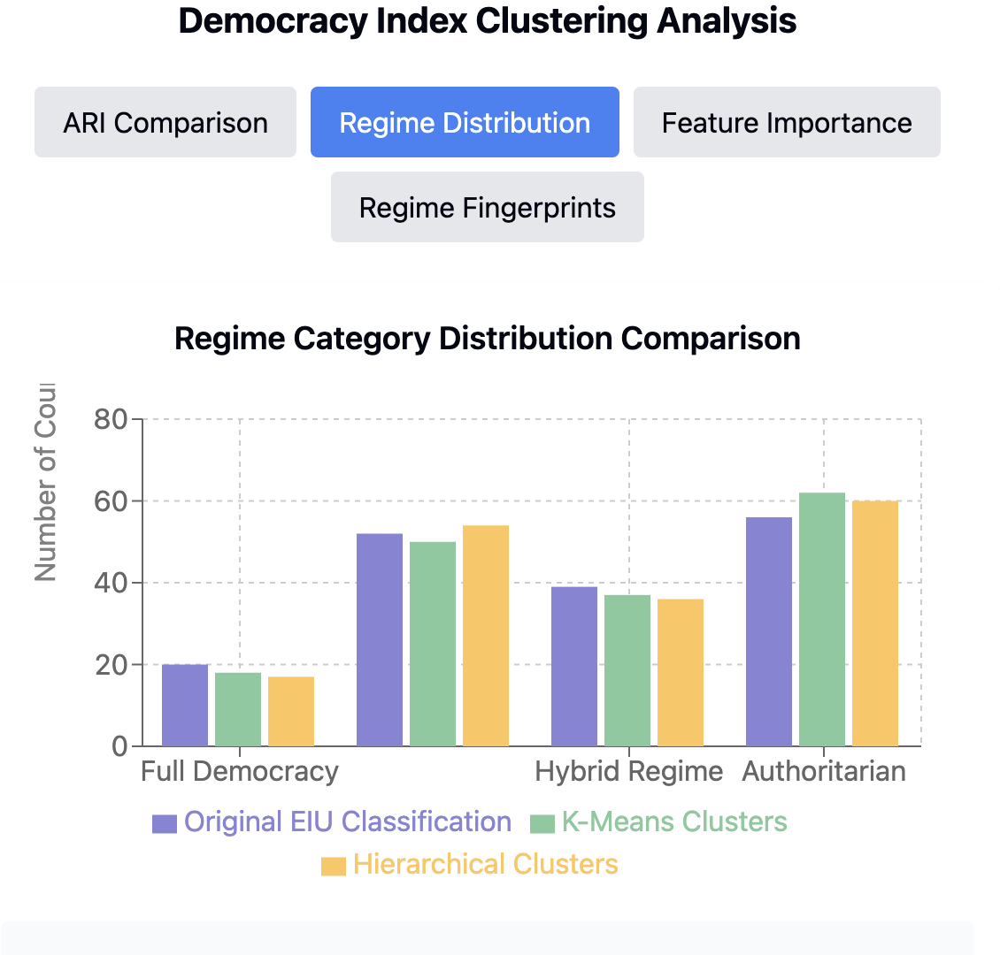
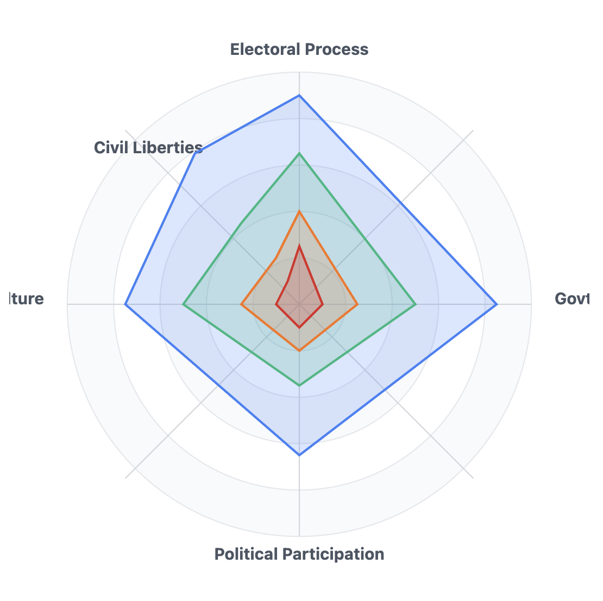

## Understanding Democracy Profiles Through Cluster Analysis

## Clustering Analysis Results

  

### Feature Importance

  

### Comparison with Expert Classifications

  

### Regime Category Distribution Comparison

  

## Interactive Dashboard

For an interactive version of these visualizations, [click here](https://rosalinatorres888.github.io/democracy-clustering-analysis/interactive_dashboard.html).

  

## Overview
This project applies unsupervised machine learning techniques to analyze the Economist Intelligence Unit's Democracy Index data. By using clustering algorithms (K-means and Hierarchical clustering), this analysis reveals natural groupings of countries based on five dimensions of democracy: electoral processes and pluralism, functioning of government, political participation, political culture, and civil liberties.
