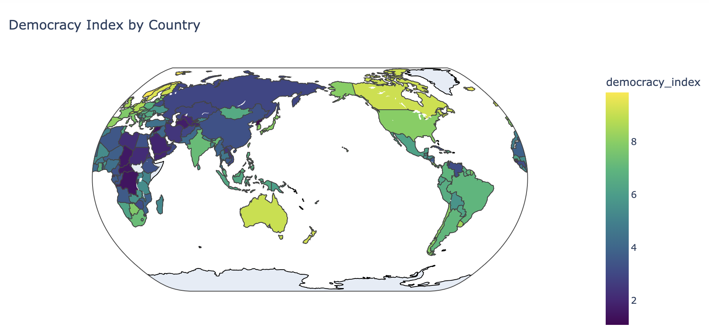

# Democracy Clustering Analysis

Using K-means and hierarchical clustering to analyze democracy data and reveal insights about regime types and democratic transitions beyond traditional classifications.

## [View Interactive Dashboard](https://rosalinatorres888.github.io/democracy-clustering-analysis/)

## Geographic Visualization of Democracy Index

This visualization shows the democracy index by country, revealing patterns of democratic development across the globe:

## Introduction

In a time when democratic values are being tested — strained by polarization, misinformation, and institutional fatigue — we ask: Can the language of data reveal the deeper structure of democracy worldwide?

This project explores The Economist’s Democracy Index, a globally recognized benchmark that scores nations annually across key pillars of democratic life. By applying unsupervised machine learning — K-Means and Hierarchical Clustering — we aim to discover whether countries cluster in ways that confirm or challenge existing regime labels.

Thesis:
Through algorithmic clustering, we test whether democratic classifications hold up to the scrutiny of pattern recognition — and whether data alone can expose emerging shifts in global governance.

⸻

### About the Dataset

At the heart of this analysis lies the Democracy Index, compiled annually by the Economist Intelligence Unit (EIU). It evaluates nations across five dimensions:

- **Electoral Process and Pluralism** – Do citizens have a voice? Are elections fair, and can political parties operate freely?  
- **Functioning of Government** – Is governance effective, transparent, and free from corruption?  
- **Political Participation** – Are people engaged beyond the ballot box?  
- **Political Culture** – Do societal values support democracy and tolerate dissent?  
- **Civil Liberties** – Are freedoms of speech, press, and protest actively protected?

Countries are assigned to one of four regime types:

- **Full Democracies**  
- **Flawed Democracies**  
- **Hybrid Regimes**  
- **Authoritarian Regimes**

These labels are well-informed — but ultimately human-made. Our analysis asks: *Do the numbers agree with the narratives?*

---

### Analytical Goal

This project does not seek to assess political ideologies or pass judgment on any particular system. Rather, it applies unsupervised machine learning techniques — **K-Means** and **Hierarchical Clustering** — to examine how nations naturally group based on their numerical scores across democratic indicators, without using regime labels as guidance. In doing so, we aim to:

- Determine whether natural groupings align with the EIU’s classifications.
- Identify where machine-defined clusters diverge from official regime types — and why.
- Surface potential geopolitical or socio-economic signals that might explain these patterns.

---

### Why This Matters

Democracy, by its very nature, resists reduction to a single score. But when we distill its dimensions into measurable data, we create an opportunity to observe its **shapes**, not just its **ideals**. In an age of political complexity, this approach doesn’t simplify — it **illuminates**.

Whether the results reinforce the status quo or surface new questions, this analysis adds a layer of clarity to the global conversation on governance. Through data, we gain a wider lens — not to declare verdicts, but to explore the structure of democratic life with both curiosity and care.

[📖 Learn more about the Democracy Index](https://en.wikipedia.org/wiki/The_Economist_Democracy_Index)

## About This Project

This project uses machine learning techniques to cluster countries based on various democracy indicators, identifying patterns that go beyond traditional classifications of democratic, hybrid, and authoritarian regimes.

Key findings include:
- Identification of transition countries at cluster boundaries
- Patterns of regional democratic development
- Insights into the relationship between various democracy indicators

## 🧪 Methodology & Workflow

### ▶ Data Ingestion & Cleaning

- Cleaned and standardized Democracy Index
- Removed missing values and normalized features

### ▶ Dimensionality Reduction

- Applied PCA: retained 4 components (82% variance explained)

### ▶ Clustering

- Used **K-Means** and **Agglomerative Clustering**
- Chose optimal k using Elbow + Silhouette analysis

### ▶ Evaluation

- Compared clusters with regime types (full, flawed, hybrid, authoritarian)
- Created **Democratic Stability Index** to flag borderline cases

## Technologies Used
- Python
- scikit-learn
- Plotly
- Pandas
- NumPy

## How to Run
1. Clone this repository
2. Install the required packages: `pip install -r requirements.txt`
3. Run the Jupyter notebook: `jupyter notebook my_democracy-clustering-notebook-torres.ipynb`
