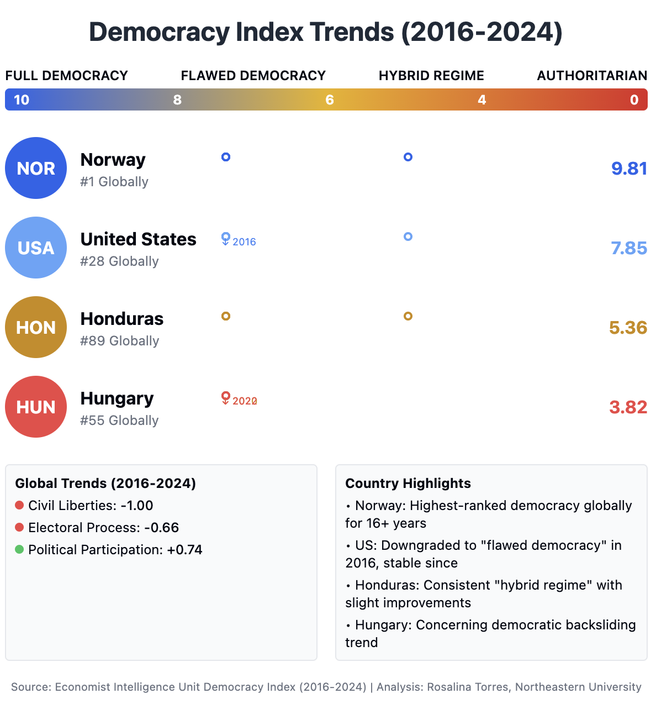
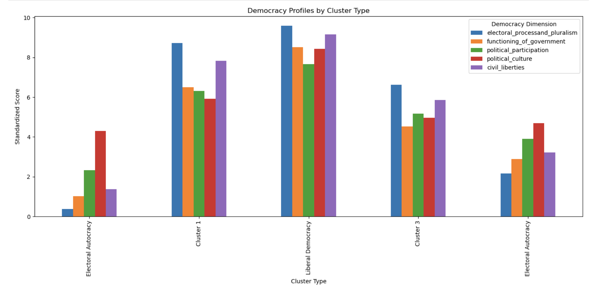
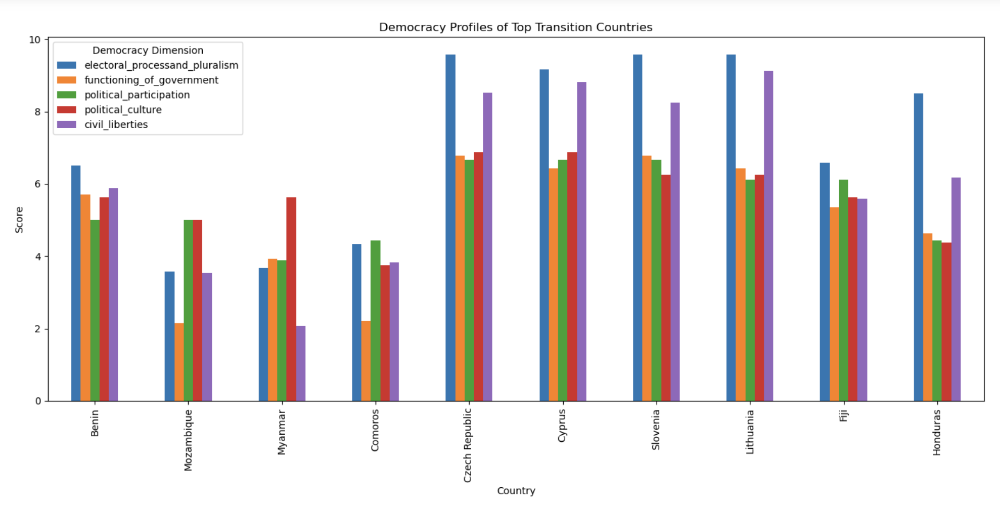

## Understanding Democracy Profiles Through Cluster Analysis


<p><em>Figure 1: Democracy Index Trends (2016-2024)
This figure illustrates the comparative democracy scores of select nations according to the Economist Intelligence Unit's Democracy Index. Norway leads globally with a score of 9.81, firmly in the "Full Democracy" category. The United States ranks 28th globally with a score of 7.85 in the "Flawed Democracy" category, a classification it has maintained since its downgrade in 2016. Honduras (5.36) operates as a "Hybrid Regime" at 89th place globally, while Hungary shows concerning democratic backsliding with a score of 3.82, placing it 55th globally and approaching authoritarian status. Global trends indicate declines in Civil Liberties (-1.00) and Electoral Process (-0.66), though Political Participation shows improvement (+0.74).</em></p>
</div>

## Overview
This project applies unsupervised machine learning techniques to analyze the Economist Intelligence Unit's Democracy Index data. By using clustering algorithms (K-means and Hierarchical clustering), this analysis reveals natural groupings of countries based on five dimensions of democracy: electoral processes and pluralism, functioning of government, political participation, political culture, and civil liberties.

## Key Findings
- Natural clustering patterns align substantially with expert classifications (ARI: 0.665, AMI: 0.715)
- Democracy is better understood as distinct profiles rather than a linear spectrum
- Hybrid regimes and transitioning countries provide the most valuable insights about democratic development
- Different dimensions of democracy develop unevenly across countries, with electoral process and civil liberties showing the most variance between regimes

## Dataset
The analysis uses the Economist Intelligence Unit's Democracy Index data, which rates countries on a scale of 0-10 across five dimensions, with an overall score determining classification as:
- Full Democracy (8.01-10.00)
- Flawed Democracy (6.01-8.00)
- Hybrid Regime (4.01-6.00)
- Authoritarian Regime (0-4.00)

## Methods



### Data Preprocessing
- Data standardization to ensure dimensions with different scales don't dominate the analysis
- Multiple imputation for handling missing values
- Feature engineering to capture trade-offs between dimensions

### Clustering Algorithms
- K-means clustering for identifying distinct democracy profiles
- Hierarchical clustering for revealing nested relationships between regime types
- Optimal cluster determination using:
  - Elbow method
  - Silhouette scores
  - Gap statistic

### Validation
- Comparison with EIU's regime classifications
- Evaluation using metrics like Adjusted Rand Index (ARI) and Normalized Mutual Information (NMI)
- Analysis of confusion matrix to identify regime types that are frequently misclassified

## Visualizations
- Radar charts for comparing democratic profiles across multiple dimensions
- PCA and t-SNE for dimensionality reduction and exploration
- Silhouette plots to evaluate cluster quality
- Geographic visualization of clusters
- Analysis of boundary/transition countries



## Boundary Case Analysis
This project places special emphasis on examining countries that sit between regime types, including:
- Democratic backsliding cases (e.g., Hungary, Poland)
- Regimes oscillating between democracy and autocracy (e.g., Turkey)
- Countries with small score changes leading to reclassification

## Usage
The Jupyter notebook provides a complete workflow from data loading to interpretation. To replicate:

1. Clone this repository:
```bash
git clone https://github.com/rosalinatf/democracy-clustering-analysis.git
cd democracy-clustering-analysis
```

2. Install required packages:
```bash
pip install -r requirements.txt
```

3. Run the Jupyter notebook:
```bash
jupyter notebook notebooks/democracy_clustering_analysis.ipynb
```

## Skills Demonstrated
- **Data Exploration**: Thorough EDA of democratic dimension distributions
- **Unsupervised Learning**: Applied K-means and hierarchical clustering algorithms
- **Data Visualization**: Created interpretable visualizations of clusters 
- **Statistical Analysis**: Analyzed feature importance and cluster separation
- **Technical Communication**: Translated statistical findings into political insights

## Future Work
- Longitudinal analysis to track democratic changes over time
- Inclusion of additional democracy indices for comparative analysis
- Fuzzy clustering to better capture hybrid regime characteristics

## Author
Rosalina Torres Figueroa  
Contact: torres.ros@northeastern.edu

## License
This project is available under the MIT License.
